# **TROUD - Transportation Routing Design Cloud**

TROUD service power by OSRM (Open Source Routing Machine) allows you to calculate the best transportation/distribution route.

## TROUD Architecture

```mermaid
sequenceDiagram
Client Server ->> TROUD : Http Post Request
TROUD ->> OpenStreetMaps : Http Get Request
OpenStreetMaps ->> TROUD: OSM Response
TROUD ->> Client Server : TROUD Response 
Client Server ->> Client Front : TROUD Response

Note right of Client Front: Cliente Renderiza<br/><br/>la informacion<br/>segun reglas de <br/>negocio e <br/>implementación.
```

# Publication

*Use this documentation to analyse how TROUD service can be used from your application:* [Postman Documentation](https://documenter.getpostman.com/view/9378899/TW6zFn4K)